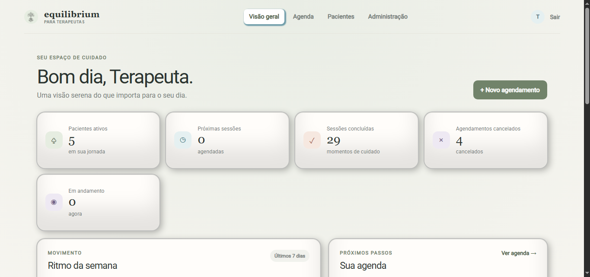
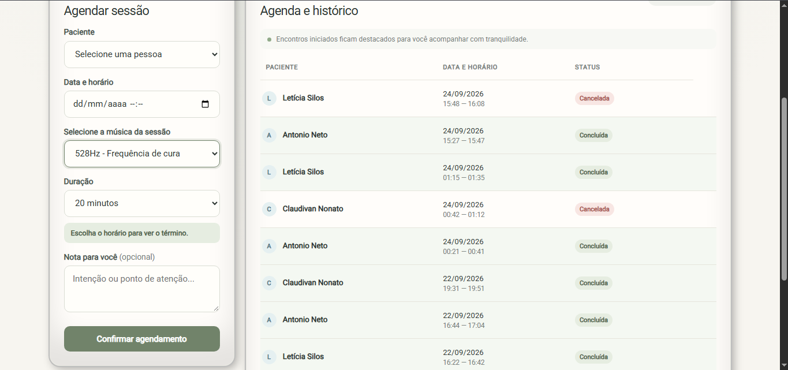
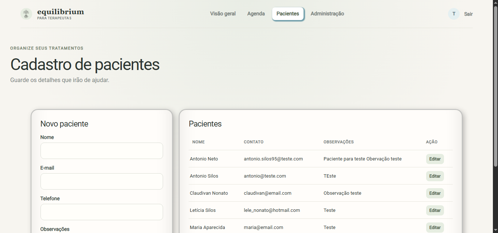
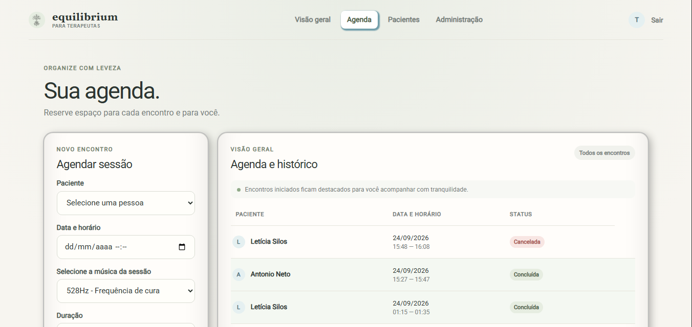
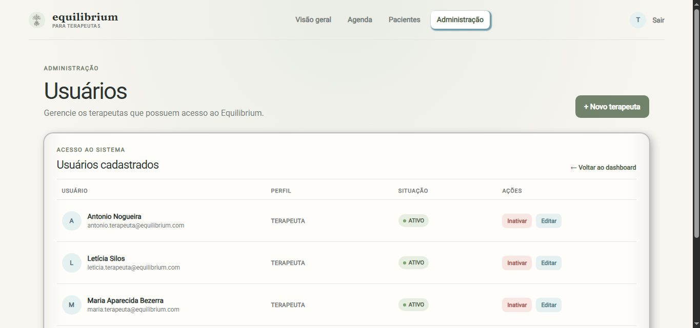

# Equilibrium

🌐 **Langue :** [English](README.md) | [Português](README.pt-BR.md) | **Français**

**Une application web multi-utilisateur conçue pour aider les thérapeutes à gérer leurs patients, leurs rendez-vous et leurs séances de thérapie à distance.**

Equilibrium est un projet de portfolio développé avec **Python, Flask et MySQL**, conçu pour accompagner les thérapeutes dans l'organisation de leur activité quotidienne tout en offrant aux patients une expérience dédiée aux séances à distance.

Le projet met l'accent non seulement sur les fonctionnalités, mais aussi sur la **sécurité, l'isolation des données, la maintenabilité et la reproductibilité de l'environnement**.

> **Statut :** Projet de portfolio actif
> **Démo en ligne :** Bientôt disponible

---

## Présentation

Equilibrium a été créé afin de centraliser les principales activités d'un cabinet de thérapeute au sein d'une seule application.

Les thérapeutes peuvent gérer leurs patients et leurs rendez-vous, tandis que chaque thérapie planifiée peut générer une séance dédiée comprenant de la musique, un compte à rebours et un jeton d'accès unique.

Le système comprend également des outils d'administration permettant de gérer les comptes des thérapeutes et leurs droits d'accès.

### Objectifs principaux

* Centraliser la gestion des patients
* Organiser les rendez-vous
* Fournir une expérience dédiée aux séances de thérapie à distance
* Isoler les données entre les thérapeutes
* Gérer les accès des thérapeutes à partir d'un compte administrateur
* Appliquer des mesures de sécurité concrètes à l'authentification et aux formulaires
* Faciliter l'installation et la reproduction du projet en environnement local

---

## Fonctionnalités

### Authentification et contrôle des accès

* Authentification sécurisée avec hachage des mots de passe via bcrypt
* Rôles `ADMIN` et `TERAPEUTA`
* Statuts de compte actif/inactif
* Invalidation automatique de la session lorsqu'un utilisateur est désactivé
* Vérification des permissions actuelles directement depuis la base de données, plutôt que de se fier uniquement aux données de session
* Limitation du nombre de tentatives de connexion
* Protection CSRF

### Administration des thérapeutes

Les administrateurs peuvent :

* Créer des comptes thérapeutes
* Modifier les informations des thérapeutes
* Activer ou désactiver des comptes
* Réinitialiser les mots de passe des thérapeutes
* Accéder à la liste administrative des utilisateurs

Une commande CLI permet également de créer de manière sécurisée le **premier administrateur** lors de l'installation d'une nouvelle instance.

---

### Gestion des patients

Les thérapeutes peuvent :

* Enregistrer des patients
* Modifier leurs informations
* Enregistrer des coordonnées facultatives et des observations
* Consulter la liste des patients avec pagination

Les dossiers des patients sont isolés grâce au champ `terapeuta_id`, afin que chaque thérapeute ne puisse travailler qu'avec ses propres patients.

Les numéros de téléphone sont normalisés avant leur enregistrement. Ainsi, des valeurs telles que :

```text
(11) 99999-9999
11 9 9999 9999
11999999999
```

sont interprétées comme le même numéro.

Le numéro de téléphone est facultatif et, lorsqu'il est renseigné, il doit être unique **dans la liste de patients du thérapeute concerné**.

---

### Gestion des rendez-vous

Les thérapeutes peuvent :

* Créer des rendez-vous
* Définir la durée d'une séance
* Choisir la musique de la séance
* Modifier la date et l'heure prévues
* Annuler des rendez-vous
* Consulter l'historique avec pagination
* Ouvrir la séance de thérapie associée à un rendez-vous

L'interface calcule également l'heure de fin prévue à partir de l'heure de début et de la durée sélectionnées.

---

### Séance de thérapie

Chaque rendez-vous peut générer une séance de thérapie dédiée.

La séance comprend :

* Un jeton d'accès unique
* Une durée configurable
* Un compte à rebours
* Une musique d'ambiance
* Des images d'arrière-plan associées aux différents thèmes
* La restauration de l'état de la séance après le rechargement de la page
* La clôture automatique de la séance
* Des contrôles de lecture audio

Les thèmes disponibles comprennent :

* 528Hz River
* Traditional
* Nature
* Ocean
* Spirit
* Cosmic

Le compte à rebours est calculé à partir des horodatages de la séance enregistrés côté serveur, ce qui évite qu'un rechargement de la page ne réinitialise une séance en cours.

---

### Tableau de bord

Le tableau de bord du thérapeute fournit une vue d'ensemble de son activité, notamment :

* Patients enregistrés
* Rendez-vous planifiés
* Rendez-vous terminés
* Rendez-vous annulés
* Prochains rendez-vous
* Patients récents

---

## Technologies

### Backend

* Python
* Flask
* MySQL
* mysql-connector-python
* bcrypt
* python-dotenv

### Sécurité

* Flask-WTF / CSRFProtect
* Flask-Limiter
* Hachage des mots de passe avec bcrypt
* Requêtes SQL paramétrées
* Authentification basée sur les sessions
* Autorisation basée sur les rôles
* Isolation des données par thérapeute

### Frontend

* HTML5
* CSS3
* JavaScript
* Jinja2

### Développement et tests

* pytest
* Flask test client
* Mocking et monkeypatching
* Git / GitHub

---

## Architecture

Equilibrium adopte une architecture Flask légère, avec une séparation entre les routes HTTP et les services responsables de la logique métier et de l'accès aux données.

```text
Navigateur
    │
    ▼
Routes Flask
    │
    ▼
Couche de services
    │
    ▼
MySQL
```

Les templates et les ressources statiques sont gérés séparément :

```text
Templates Jinja2
      │
      ├── base.html
      └── app_base.html
              │
              ├── Tableau de bord
              ├── Patients
              ├── Rendez-vous
              └── Administration
```

L'application évite volontairement d'introduire une complexité architecturale inutile, tout en maintenant une séparation claire des responsabilités.

---

## Structure du projet

```text
equilibrium/
│
├── app/
│   ├── routes/
│   ├── services/
│   ├── static/
│   │   ├── css/
│   │   ├── img/
│   │   └── js/
│   ├── templates/
│   │   └── admin/
│   ├── utils/
│   ├── cli.py
│   ├── extensions.py
│   └── __init__.py
│
├── database/
│   ├── migrations/
│   └── schema.sql
│
├── tests/
│   ├── conftest.py
│   ├── test_access.py
│   ├── test_auth.py
│   └── test_cli.py
│
├── .env.example
├── .gitignore
├── requirements.txt
├── requirements-dev.txt
└── run.py
```

---

## Base de données

Le dépôt contient le schéma complet de la base de données :

```text
database/schema.sql
```

Il permet à une nouvelle installation de recréer la structure requise sans avoir accès à la base utilisée pendant le développement.

Les principales entités sont :

```text
usuarios
pacientes
agendamentos
sessoes
```

La propriété d'un dossier patient est directement définie par `terapeuta_id`, ce qui assure une isolation des données au niveau de chaque thérapeute.

Les modifications de structure destinées aux installations existantes sont conservées dans :

```text
database/migrations/
```

---

## Installation

### 1. Cloner le dépôt

```bash
git clone <repository-url>
cd equilibrium
```

---

### 2. Créer un environnement virtuel

```bash
python -m venv venv
```

Windows :

```powershell
.\venv\Scripts\Activate.ps1
```

Linux/macOS :

```bash
source venv/bin/activate
```

---

### 3. Installer les dépendances

```bash
pip install -r requirements.txt
```

---

### 4. Créer la base de données MySQL

```sql
CREATE DATABASE equilibrium
CHARACTER SET utf8mb4
COLLATE utf8mb4_unicode_ci;
```

Importer ensuite le schéma :

```sql
USE equilibrium;

source database/schema.sql;
```

---

### 5. Configurer les variables d'environnement

Créer un fichier `.env` à partir de :

```text
.env.example
```

Exemple :

```env
SECRET_KEY=replace-with-a-secure-secret-key

DB_HOST=localhost
DB_USER=root
DB_PASS=your_mysql_password
DB_NAME=equilibrium
```

Une clé secrète Flask sécurisée peut être générée avec Python :

```bash
python -c "import secrets; print(secrets.token_hex(32))"
```

Le véritable fichier `.env` ne doit jamais être versionné.

---

### 6. Créer le premier administrateur

Une fois la base de données créée :

```bash
python -m flask --app run.py create-admin
```

La commande CLI demandera :

```text
Nom
E-mail
Téléphone
Mot de passe
Confirmation du mot de passe
```

Le mot de passe est haché de manière sécurisée avant d'être enregistré.

Cette commande est destinée à initialiser une nouvelle installation et refuse de créer un nouvel administrateur initial lorsqu'un administrateur existe déjà.

---

### 7. Démarrer l'application

```bash
python run.py
```

L'application sera disponible localement à l'adresse :

```text
http://127.0.0.1:5000
```

Pour le développement avec le mode debug de Flask :

```bash
python -m flask --app run.py run --debug
```

Le mode debug ne doit pas être utilisé en production.

---

## Vérification de l'état de l'application

Equilibrium expose l'endpoint :

```text
GET /health
```

Lorsque l'application et la base de données sont disponibles :

```json
{
  "api": "online",
  "database": "online",
  "status": "ok"
}
```

Code HTTP :

```text
200 OK
```

Si l'application ne parvient pas à se connecter à la base de données :

```text
503 Service Unavailable
```

---

## Tests automatisés

Les dépendances de développement peuvent être installées avec :

```bash
pip install -r requirements-dev.txt
```

Pour exécuter la suite de tests :

```bash
python -m pytest
```

La suite actuelle se concentre sur les comportements critiques de l'application et ceux liés à la sécurité.

### Authentification

Les tests couvrent :

* Utilisateurs actifs avec des identifiants valides
* Utilisateurs inactifs
* Mots de passe incorrects
* Utilisateurs inexistants
* Échecs de connexion à la base de données

### Sessions et autorisation

Les tests vérifient notamment que :

* Les routes protégées refusent les accès non authentifiés
* Les utilisateurs actifs peuvent accéder aux routes protégées
* Les utilisateurs désactivés perdent leurs sessions authentifiées existantes
* Les thérapeutes ne peuvent pas accéder aux routes administratives
* Les administrateurs peuvent accéder aux routes administratives
* Un ancien rôle enregistré dans la session ne peut pas remplacer les permissions actuelles stockées en base de données

### CLI

Les tests couvrent :

* La création réussie de l'administrateur initial
* La prévention de la création de plusieurs administrateurs initiaux
* La validation du mot de passe
* Les erreurs provenant de la couche de services

Lorsque cela est pertinent, les tests utilisent des mocks afin de valider les principales règles d'authentification et d'autorisation sans dépendre d'une véritable instance MySQL.

---

## Sécurité

La sécurité a été intégrée à la conception de l'application plutôt que traitée comme une amélioration secondaire.

Les mesures mises en œuvre comprennent :

* Hachage des mots de passe avec bcrypt
* Protection CSRF
* Limitation des tentatives de connexion
* Requêtes SQL paramétrées
* Filtrage des données par thérapeute
* Vérifications d'autorisation côté serveur
* Vérification du statut du compte lors des requêtes protégées
* Invalidation des sessions des utilisateurs désactivés
* Secrets et identifiants de base de données stockés dans des variables d'environnement
* Messages d'échec d'authentification génériques
* Jetons d'accès aux séances générés de manière sécurisée

Aucun identifiant réel n'est stocké dans le dépôt.

---

## Captures d'écran

### Tableau de bord



### Details du tableau de bord



### Gestion des patients



### Gestion des rendez-vous



### Details de la gestion des rendez-vous


### Séance de thérapie


### Administration



## Ressources audio

La séance de thérapie comprend des pistes audio originales générées spécifiquement pour le projet Equilibrium à l'aide de Suno dans le cadre d'un abonnement payant.

Les fichiers audio sont inclus afin de permettre de reproduire localement l'expérience complète d'une séance.

**Les ressources audio ne sont pas couvertes par la licence logicielle de ce dépôt et ne peuvent pas être redistribuées séparément du projet sans autorisation.**

---

## Choix de conception

Plusieurs décisions importantes ont été prises au cours du développement.

### Autorisation basée sur la base de données

La session permet d'identifier l'utilisateur connecté, mais son statut actuel et ses permissions sont vérifiés directement dans la base de données.

Cela empêche d'anciennes données de session de conserver un accès après la désactivation d'un compte ou la modification de son rôle.

### Intégrité assurée par la base de données

Les contraintes importantes, telles que l'unicité du numéro de téléphone d'un patient au sein de la liste d'un thérapeute, sont appliquées au niveau de la base de données.

La couche de services traduit ensuite les erreurs d'intégrité techniques en messages compréhensibles pour l'utilisateur.

### Stockage normalisé des numéros de téléphone

Les numéros de téléphone sont normalisés avant leur enregistrement au lieu de conserver les caractères de mise en forme.

Le format d'affichage peut ainsi évoluer indépendamment de la valeur enregistrée.

### Architecture légère

Le projet utilise volontairement une architecture Flask simple et lisible plutôt que d'introduire inutilement des repositories, ORM ou couches architecturales complexes.

L'objectif est de conserver une bonne maintenabilité et une séparation claire des responsabilités sans tomber dans la sur-ingénierie.

---

## Évolutions possibles

Parmi les améliorations envisageables :

* Authentification à deux facteurs pour les comptes administrateurs
* Journalisation plus avancée en production
* Stockage externe pour le rate limiting dans un environnement distribué
* Couverture de tests automatisés plus large
* Améliorations d'accessibilité
* Rapports et analyses plus détaillés
* Supervision du déploiement

---

## Auteur

**Antonio Silos**

Développeur logiciel orienté backend, API, bases de données et applications web pratiques.

---

## Licence

La licence du code source sera définie avant la publication publique du projet.

Les ressources audio sont exclues de la licence logicielle et restent soumises à leurs propres conditions d'utilisation.
