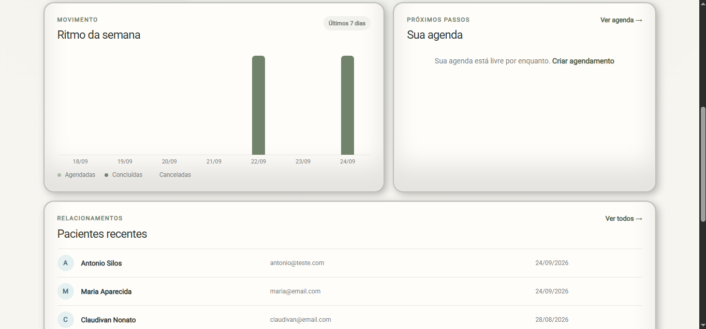

# Equilibrium

🌐 **Language:** **English** | [Português](README.pt-BR.md) | [Français](README.fr.md)

**A multi-user web application for therapists to manage patients, appointments and remote therapy sessions.**

Equilibrium is a portfolio project built with **Python, Flask and MySQL**, designed to support therapists in organizing their daily workflow while providing patients with a dedicated remote session experience.

The project focuses not only on functionality, but also on **security, data isolation, maintainability and reproducible setup**.

> **Status:** Active portfolio project
> **Live demo:** Coming soon

---

## Overview

Equilibrium was created to centralize the main activities of a therapist's practice in a single application.

Therapists can manage patients and appointments, while each scheduled therapy can generate a dedicated session with music, a countdown timer and a unique access token.

The system also includes administrative tools for managing therapist accounts and access permissions.

### Main goals

* Centralize patient management
* Organize appointments
* Provide a dedicated remote therapy session
* Isolate data between therapists
* Manage therapist access through an administrator account
* Apply practical security measures to authentication and forms
* Keep the project easy to install and reproduce locally

---

## Features

### Authentication and access control

* Secure authentication with bcrypt password hashing
* `ADMIN` and `TERAPEUTA` roles
* Active/inactive account status
* Automatic session invalidation when a user is deactivated
* Current permissions are validated against the database instead of relying only on session data
* Login rate limiting
* CSRF protection

### Therapist administration

Administrators can:

* Create therapist accounts
* Edit therapist information
* Activate or deactivate accounts
* Reset therapist passwords
* Access the administrative user list

A CLI command is also available to securely create the **first administrator** when setting up a new installation.

---

### Patient management

Therapists can:

* Register patients
* Edit patient information
* Store optional contact information and observations
* Browse patients with pagination

Patient records are isolated using `terapeuta_id`, ensuring that each therapist only works with their own patient data.

Phone numbers are normalized before storage, so values such as:

```text
(11) 99999-9999
11 9 9999 9999
11999999999
```

are treated as the same number.

Phone numbers are optional and, when provided, must be unique **within the therapist's own patient list**.

---

### Appointment management

Therapists can:

* Create appointments
* Select session duration
* Choose session music
* Edit scheduled date and time
* Cancel appointments
* Browse appointment history with pagination
* Open the therapy session associated with an appointment

The interface also calculates the expected session end time based on the selected start time and duration.

---

### Therapy session

Each appointment can generate a dedicated therapy session.

The session includes:

* Unique access token
* Configurable session duration
* Countdown timer
* Background music
* Theme-specific background images
* Persistent session state after page reload
* Automatic session completion
* Audio playback controls

Available session themes include:

* 528Hz River
* Traditional
* Nature
* Ocean
* Spirit
* Cosmic

The countdown is calculated from server-side session timestamps, preventing a page reload from resetting an active session.

---

### Dashboard

The therapist dashboard provides an overview of the practice, including indicators such as:

* Registered patients
* Scheduled appointments
* Completed appointments
* Cancelled appointments
* Upcoming appointments
* Recent patients

---

## Tech Stack

### Backend

* Python
* Flask
* MySQL
* mysql-connector-python
* bcrypt
* python-dotenv

### Security

* Flask-WTF / CSRFProtect
* Flask-Limiter
* bcrypt password hashing
* Parameterized SQL queries
* Session-based authentication
* Role-based authorization
* Per-therapist data isolation

### Frontend

* HTML5
* CSS3
* JavaScript
* Jinja2

### Development and testing

* pytest
* Flask test client
* Mocking and monkeypatching
* Git / GitHub

---

## Architecture

Equilibrium follows a lightweight Flask architecture with separation between HTTP routes and business/data-access services.

```text
Browser
   │
   ▼
Flask Routes
   │
   ▼
Service Layer
   │
   ▼
MySQL
```

Templates and static assets are handled separately:

```text
Jinja2 Templates
      │
      ├── base.html
      └── app_base.html
              │
              ├── Dashboard
              ├── Patients
              ├── Appointments
              └── Administration
```

The application intentionally avoids unnecessary architectural complexity while maintaining separation of responsibilities.

---

## Project Structure

```text
equilibrium/
│
├── app/
│   ├── routes/
│   ├── services/
│   ├── static/
│   │   ├── css/
│   │   ├── img/
│   │   └── js/
│   ├── templates/
│   │   └── admin/
│   ├── utils/
│   ├── cli.py
│   ├── extensions.py
│   └── __init__.py
│
├── database/
│   ├── migrations/
│   └── schema.sql
│
├── tests/
│   ├── conftest.py
│   ├── test_access.py
│   ├── test_auth.py
│   └── test_cli.py
│
├── .env.example
├── .gitignore
├── requirements.txt
├── requirements-dev.txt
└── run.py
```

---

## Database

The repository contains a complete database schema:

```text
database/schema.sql
```

This allows a new installation to recreate the required database structure without access to the original development database.

Main entities include:

```text
usuarios
pacientes
agendamentos
sessoes
```

Patient ownership is defined directly through `terapeuta_id`, providing tenant-level data isolation.

Database changes that affect existing installations are stored under:

```text
database/migrations/
```

---

## Installation

### 1. Clone the repository

```bash
git clone <repository-url>
cd equilibrium
```

---

### 2. Create a virtual environment

```bash
python -m venv venv
```

Windows:

```powershell
.\venv\Scripts\Activate.ps1
```

Linux/macOS:

```bash
source venv/bin/activate
```

---

### 3. Install dependencies

```bash
pip install -r requirements.txt
```

---

### 4. Create the MySQL database

```sql
CREATE DATABASE equilibrium
CHARACTER SET utf8mb4
COLLATE utf8mb4_unicode_ci;
```

Import the schema:

```sql
USE equilibrium;

source database/schema.sql;
```

---

### 5. Configure environment variables

Create a `.env` file based on:

```text
.env.example
```

Example:

```env
SECRET_KEY=replace-with-a-secure-secret-key

DB_HOST=localhost
DB_USER=root
DB_PASS=your_mysql_password
DB_NAME=equilibrium
```

You can generate a secure Flask secret key with Python:

```bash
python -c "import secrets; print(secrets.token_hex(32))"
```

Never commit the real `.env` file.

---

### 6. Create the first administrator

After the database has been created:

```bash
python -m flask --app run.py create-admin
```

The CLI will request:

```text
Name
Email
Phone
Password
Password confirmation
```

The password is securely hashed before being stored.

The command is intended for bootstrapping a new installation and will refuse to create another initial administrator when one already exists.

---

### 7. Start the application

```bash
python run.py
```

The application will be available locally at:

```text
http://127.0.0.1:5000
```

For development with Flask debug mode:

```bash
python -m flask --app run.py run --debug
```

Debug mode should not be enabled in production.

---

## Health Check

Equilibrium exposes:

```text
GET /health
```

When both the application and database are available:

```json
{
  "api": "online",
  "database": "online",
  "status": "ok"
}
```

HTTP status:

```text
200 OK
```

If the application cannot connect to the database, the endpoint returns:

```text
503 Service Unavailable
```

---

## Automated Tests

Development dependencies are installed with:

```bash
pip install -r requirements-dev.txt
```

Run the test suite:

```bash
python -m pytest
```

The current test suite focuses on security-sensitive and critical application behavior.

### Authentication

Tests cover:

* Active users with valid credentials
* Inactive users
* Incorrect passwords
* Unknown users
* Database connection failures

### Session and authorization

Tests verify that:

* Protected routes reject unauthenticated access
* Active users can access protected routes
* Deactivated users lose existing authenticated sessions
* Therapists cannot access administrator routes
* Administrators can access administrator routes
* Stale role information stored in the session cannot override current database permissions

### CLI

Tests cover:

* Successful administrator bootstrap
* Prevention of multiple initial administrators
* Password validation
* Service-layer errors

The tests use mocks where appropriate so the main authentication and authorization rules can be validated without depending on a real MySQL instance.

---

## Security Considerations

Security was treated as part of the application design rather than an afterthought.

Implemented measures include:

* Password hashing with bcrypt
* CSRF protection
* Login rate limiting
* Parameterized SQL queries
* Per-therapist data filtering
* Server-side authorization checks
* Account status verification on protected requests
* Session invalidation for deactivated users
* Environment-based secrets and database credentials
* Generic authentication failure messages
* Secure random session access tokens

No real credentials are stored in the repository.

---

## Screenshots

### Dashboard


### Dashboard details



### Patient management


### Appointment management


### Appointment management details


### Therapy session


### Administration


---

## Audio Assets

The therapy session includes original audio tracks generated specifically for the Equilibrium project using Suno under a paid subscription.

The audio files are included so the project can reproduce the complete session experience locally.

**The audio assets are not covered by the software license of this repository and may not be redistributed separately from the project without permission.**

---

## Design Decisions

Some important decisions made during development include:

### Database-backed authorization

The session identifies the logged-in user, but current account status and permissions are validated against the database.

This prevents stale session data from keeping access after an account has been deactivated or its role changed.

### Database integrity over application-only checks

Important constraints such as patient phone uniqueness are enforced at the database level.

Application services translate database integrity errors into user-friendly messages.

### Canonical phone storage

Phone numbers are normalized before persistence instead of storing formatting characters.

Presentation formatting can therefore change independently from the stored value.

### Lightweight architecture

The project intentionally uses a straightforward Flask architecture instead of introducing unnecessary repositories, ORMs or complex architectural layers.

The goal is maintainability and clear responsibility boundaries without over-engineering.

---

## Roadmap

Possible future improvements include:

* Two-factor authentication for administrator accounts
* Improved production logging
* External rate-limit storage for distributed deployments
* Additional automated coverage
* Improved accessibility
* Expanded reporting and analytics
* Deployment monitoring

---

## Author

**Antonio Silos**

Software developer focused on backend development, APIs, databases and practical web applications.

---

## License

The software license for the source code will be defined before the public release.

Audio assets are excluded from the software license and remain subject to their own usage restrictions.
